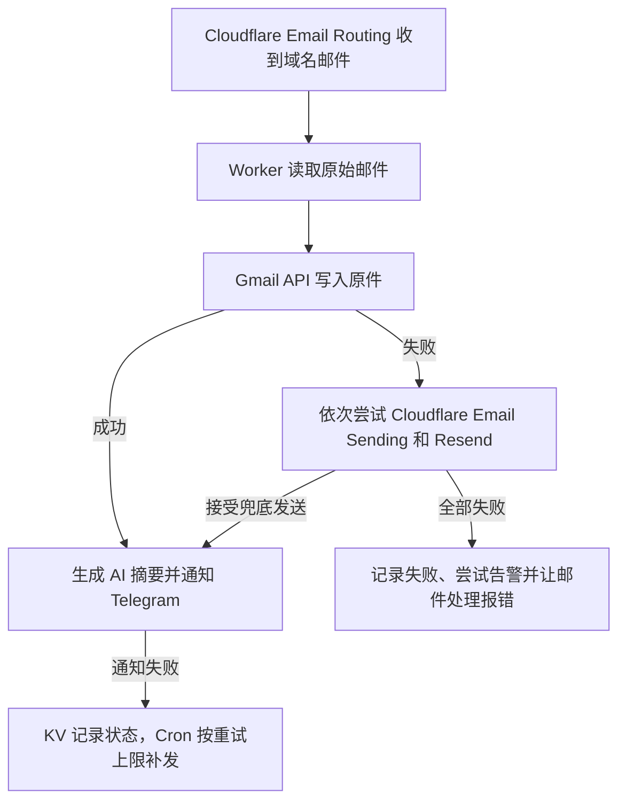

# Synopsis

将域名邮件完整备份到 Gmail，并在 Telegram 私聊中接收中文摘要。运行在 Cloudflare Workers 上，支持通用 OpenAI 兼容接口、OpenRouter 和 Gemini。

## 功能

- 通过 Gmail API 直接保存原始 MIME，包括邮件头、正文和附件。
- Telegram 提供中文摘要、验证码复制和可读正文查看。点「原文」后可再点「返回摘要」重新生成。
- Gmail 主备份成功时，可在本人 Bot 私聊中将对应 Gmail 副本移入垃圾箱并删除 Telegram 消息。
- Gmail 备份失败时，依次尝试 Cloudflare Email Sending 和 Resend，发送带 `original.eml` 附件的兜底邮件。
- AI 或 Telegram 失败不影响已经完成的原件备份；定时任务每 5 分钟按状态补发通知和告警。

项目面向个人单账号使用，Telegram 仅支持本人私聊。正文缓存和消息映射默认保存 7 天，完整邮件保存在备份邮箱。

## 工作方式



Gmail 主备份使用 `users.messages.insert`，写入 OAuth 授权账号。兜底邮件发送到 `BACKUP_EMAIL_TO`，该地址应能独立收信，避免再次路由回本 Worker。兜底服务接受发送请求后记录成功，最终投递仍受收件方策略影响。

详细数据流和状态字段见 [架构文档](docs/ai-maintenance/architecture.md)。

## 部署准备

需要 Node.js 22 或以上版本、`package.json` 指定版本的 pnpm，以及以下资源：

| 是否需要 | 资源 | 用途 |
|---|---|---|
| 必需 | 接入 Cloudflare 的域名，以及 Email Routing、Workers 和 KV | 接收邮件、运行程序、保存状态和缓存 |
| 必需 | Gmail 账号及自己的 Google OAuth 客户端 | 保存原始邮件 |
| 必需 | Telegram Bot 和本人私聊 ID | 接收摘要、操作邮件 |
| 三选一 | 通用 OpenAI 兼容服务、OpenRouter 或 Gemini 的密钥和模型 | 生成摘要，只需申请所选服务 |
| 可选兜底 | Cloudflare Email Sending 的已验证发件域名 | Gmail 失败后的第一兜底 |
| 可选兜底 | Resend 的已验证发件地址及密钥 | Gmail 和 Cloudflare 兜底失败后使用 |

可以先配置 Gmail、Telegram 和一种 AI 服务。正式收信建议至少配好一种兜底；两种都未配置时，Gmail 失败会导致本次原件备份失败。

各服务的费用、配额和地区可用性由服务商决定。邮件内容会发送到这些服务，详见 [隐私说明](docs/privacy.md)。

## 安装与配置

配置分为四组，按顺序填写即可：

1. **基础必填**：Gmail 的 3 项授权信息、Telegram 的 3 项配置，以及 KV 绑定。
2. **AI 三选一**：填写所选供应商的模型和 API key；另外两家无需申请或填写。
3. **邮件兜底**：按使用的兜底服务填写，正式收信建议配置。
4. **可选参数**：Base URL、提示词、解析大小和重试次数等，一般可用默认值。使用其他 OpenAI 兼容服务时，需要填写该服务的 Base URL。

### 安装依赖和创建 KV

下载项目后，在项目目录执行：

```bash
pnpm install --frozen-lockfile
cp wrangler.example.jsonc wrangler.jsonc
cp .dev.vars.example .dev.vars
pnpm exec wrangler login
pnpm exec wrangler kv namespace create MAIL_KV
pnpm exec wrangler kv namespace create MAIL_KV --preview
```

编辑本机的 `wrangler.jsonc`，填写 Worker 名称和两个 KV ID。`send_email` 是 Cloudflare 发信兜底绑定，示例中已注释，需要该兜底时再按下文配置。

真实 `wrangler.jsonc`、`.dev.vars` 和 `.env*` 被 Git 忽略，需自行安全备份。`.dev.vars` 供本地运行使用，不会自动成为生产 Secrets。

| 配置内容 | 本地开发 | 生产部署 |
|---|---|---|
| 账号信息、API key、webhook 密钥、兜底邮箱地址 | 填写 `.dev.vars` 对应项 | 使用 `pnpm exec wrangler secret put 变量名` 交互写入 |
| AI 模式、模型及可选参数 | `wrangler.jsonc` 的 `vars` | 随 `wrangler.jsonc` 部署 |
| KV、Cloudflare 发信绑定 | `wrangler.jsonc` 对应绑定项 | 随 `wrangler.jsonc` 部署 |

### 1. 基础必填：Gmail 和 Telegram

先完成 [Gmail OAuth 设置](docs/gmail-oauth-setup.md) 和 [Telegram Bot 设置](docs/telegram-setup.md)，准备以下 6 项配置：

| 必填变量 | 填什么 |
|---|---|
| `GMAIL_CLIENT_ID` | 自己的 Google OAuth 客户端 ID |
| `GMAIL_CLIENT_SECRET` | 同一个 OAuth 客户端的密钥 |
| `GMAIL_REFRESH_TOKEN` | 授权备份 Gmail 账号后取得的 refresh token |
| `TG_BOT_TOKEN` | BotFather 创建 Bot 后给出的 token |
| `TG_CHAT_ID` | 本人的正整数私聊 ID；先向 Bot 发送 `/start` |
| `TG_WEBHOOK_SECRET` | 自行生成的随机字符串，只用字母、数字、下划线或短横线；注册 webhook 时使用同一个值 |

Gmail OAuth 应用长期使用时应检查发布状态；External + Testing 下，本项目所需权限的 refresh token 通常在 7 天后过期。

本地开发填写 `.dev.vars` 的「基础必填」组。生产部署依次执行：

```bash
pnpm exec wrangler secret put GMAIL_CLIENT_ID
pnpm exec wrangler secret put GMAIL_CLIENT_SECRET
pnpm exec wrangler secret put GMAIL_REFRESH_TOKEN
pnpm exec wrangler secret put TG_BOT_TOKEN
pnpm exec wrangler secret put TG_CHAT_ID
pnpm exec wrangler secret put TG_WEBHOOK_SECRET
```

首次使用 `secret put` 时，如果提示创建尚不存在的同名 Worker，可以创建；后续部署会上传完整程序。

### 2. AI 三选一：只填写所选供应商

在 `wrangler.jsonc` 的 `vars` 中设置模式和模型，再写入对应密钥。模型名没有默认值，必须替换为所选服务实际可用的模型。

| 选择 | `SUMMARY_PROVIDER` | 该模式必填 | 可选基础地址及默认值 |
|---|---|---|---|
| 通用 OpenAI 兼容接口 | `openai`（默认） | `OPENAI_MODEL`、`OPENAI_API_KEY` | `OPENAI_BASE_URL`：`https://api.openai.com/v1` |
| OpenRouter 专用模式 | `openrouter` | `OPENROUTER_MODEL`、`OPENROUTER_API_KEY` | `OPENROUTER_BASE_URL`：`https://openrouter.ai/api/v1` |
| Gemini 原生接口 | `gemini` | `GEMINI_MODEL`、`GEMINI_API_KEY` | `GEMINI_BASE_URL`：`https://generativelanguage.googleapis.com/v1beta` |

**例如选择 Gemini**，把示例中 OpenAI 的模式和模型两项替换为：

```json
{
  "SUMMARY_PROVIDER": "gemini",
  "GEMINI_MODEL": "YOUR_GEMINI_MODEL_ID"
}
```

以上是 `vars` 内的配置片段，保留文件中的其他设置。本地取消 `.dev.vars` 中 `GEMINI_API_KEY` 的注释并填入密钥；生产执行：

```bash
pnpm exec wrangler secret put GEMINI_API_KEY
```

这样就完成 Gemini 摘要配置，`GEMINI_BASE_URL` 可以省略。选择其他模式时，按表替换模式、模型和密钥名即可；两个示例文件也已按供应商分组。

使用官方接口时三种 Base URL 均可省略；使用其他 OpenAI 兼容服务或代理时，填写该模式的 Base URL。地址必须是 HTTPS 基础路径，不要带 `/chat/completions` 或 `:generateContent` 等完整方法路径。供应商扩展参数和 OpenRouter 专用选项见 [详细配置](docs/ai-maintenance/configuration-and-secrets.md#三种摘要模式)。

### 3. 邮件兜底：按需配置

Gmail 主备份成功时不会使用这些配置。可以只配置其中一种；两种都配好时，按 Cloudflare Email Sending、Resend 的顺序尝试。正式收信建议至少配好一种，减少 Gmail 授权失效或接口故障造成的备份失败。

| 使用场景 | 该场景必填 |
|---|---|
| 任一种邮件兜底 | `BACKUP_EMAIL_TO`：能独立收信、不会路由回本 Worker 的邮箱 |
| Cloudflare Email Sending | `CF_EMAIL_FROM`，以及 `wrangler.jsonc` 中名为 `EMAIL` 的 `send_email` 绑定 |
| Resend | `RESEND_API_KEY` 和 `RESEND_FROM`（已验证的发件地址） |

<details>
<summary>展开兜底配置步骤和生产 Secret 命令</summary>

本地在 `.dev.vars` 中取消所需兜底项的注释并填写。生产先写入共用收件地址：

```bash
pnpm exec wrangler secret put BACKUP_EMAIL_TO
```

使用 Cloudflare Email Sending 时，先验证发件域名，再取消 `wrangler.jsonc` 中 `send_email` 的注释，将 `allowed_sender_addresses` 替换为已验证发件地址。`CF_EMAIL_FROM` 填同一个地址：

```bash
pnpm exec wrangler secret put CF_EMAIL_FROM
```

使用 Resend 时，再写入该服务的配置：

```bash
pnpm exec wrangler secret put RESEND_API_KEY
pnpm exec wrangler secret put RESEND_FROM
```

发信账号准备见 [Gmail 与兜底设置](docs/gmail-oauth-setup.md)。未配置的兜底在执行到该步骤时会失败，并继续尝试下一家；全部备份失败时会记录失败、尝试告警并让邮件处理报错。

</details>

### 4. 可选参数：默认可不填

`SUMMARY_PROMPT` 默认使用内置中文提示词，`MAX_PARSE_BYTES` 默认 10 MiB，`CRON_LOCK_TTL_SECONDS` 默认 240 秒，`TELEGRAM_RETRY_LIMIT` 默认 3。需要调整时再加入 `wrangler.jsonc` 的 `vars`，完整默认值见 [共用配置](docs/ai-maintenance/configuration-and-secrets.md#共用配置)。

## 部署与验证

使用 OpenRouter 模式部署前，先备份本机的 `wrangler.jsonc`。

```bash
pnpm typecheck
pnpm build
pnpm run deploy
```

- `verify:config` 可用于部署前单独检查配置，不写文件；OpenRouter 模式会查询公开模型列表，reasoning 配置需要调整时会报错。`deploy` 会在上传前完成这项调整。
- `build` 使用示例配置在本地打包，不上传。
- `deploy` 检查本机配置，再做类型检查并部署；OpenRouter 模式仅在 reasoning 配置需要调整时重写整个 `wrangler.jsonc`，原有 JSONC 注释会丢掉；配置已匹配时保留原文件。

部署后完成以下设置：

1. 按 [Telegram 设置](docs/telegram-setup.md#注册-webhook) 注册 webhook，地址为 `https://<你的 Worker 地址>/telegram/webhook`，`secret_token` 与生产 `TG_WEBHOOK_SECRET` 保持一致。
2. 在 Cloudflare Email Routing 中，将指定地址或 catch-all 设置为发送到这个 Worker。
3. 访问 `https://<你的 Worker 地址>/health`，确认 HTTP 入口有响应。
4. 发送普通邮件和带附件邮件，确认 Gmail 原件、Telegram 摘要、点「原文」后能查看正文并「返回摘要」，附件能在 Gmail 中查看。

`/health` 只证明程序在响应，不表示 KV、发信绑定或外部账号可用。真实收信才能验证备份和 Telegram。删除按钮只在 Gmail 主备份成功时出现，会将对应 Gmail 副本移入垃圾箱，请只用测试邮件验证。

## 使用限制

- Telegram 原文显示可读文本，长内容会截断；完整排版和附件在 Gmail 中查看。
- “返回摘要”会按当前配置重新调用 AI，只改当前 Telegram 消息，不更新 KV 缓存，可能产生额外费用。
- 缓存到期和 Telegram 自身的删除时限会影响按钮操作。
- 大邮件受 Worker 内存、执行时间和供应商附件限制约束；`MAX_PARSE_BYTES` 只控制解析大小。
- 邮件到达 Worker 前的拒收或路由问题，需要在 Cloudflare 控制台排查。

数据保存期限、删除范围和 AI 服务的数据处理行为见 [隐私说明](docs/privacy.md)。

## 开发与维护

```bash
pnpm dev
pnpm check:public
```

默认手动部署。本机需要提交后自动部署时，可按 [运维文档](docs/ai-maintenance/operations.md#自动部署) 开启 Git hooks。

- [配置、绑定与 Secrets](docs/ai-maintenance/configuration-and-secrets.md)
- [部署更新、回滚和故障排查](docs/ai-maintenance/operations.md)
- [维护文档入口](docs/ai-maintenance/README.md)
- [贡献指南](CONTRIBUTING.md) / [安全问题](SECURITY.md)

GitHub CI 检查提交快照、执行类型检查和打包，不访问生产账号。项目使用 [MIT 许可证](LICENSE)。
