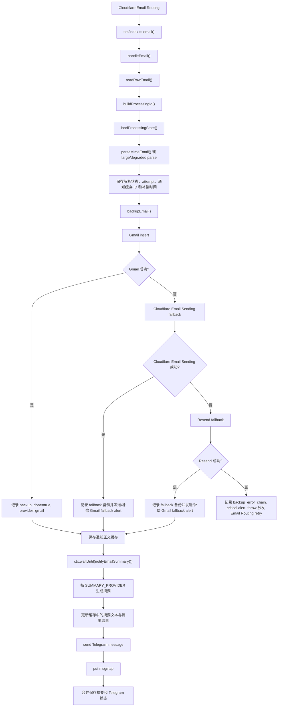
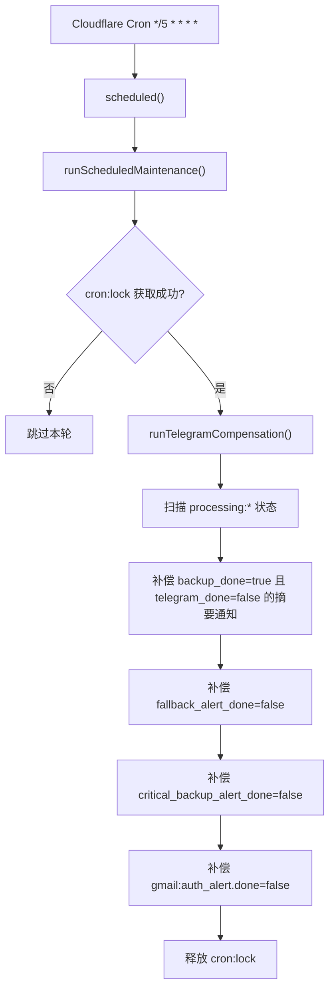

# 架构与代码地图

## 顶层入口

| 文件 | 责任 |
|------|------|
| `src/index.ts` | Cloudflare Worker export，暴露 `fetch`、`email`、`scheduled` |
| `src/router.ts` | Hono HTTP 路由注册 |
| `src/handlers/email.ts` | Email Routing 入站邮件处理主入口 |
| `src/handlers/scheduled.ts` | Cron Trigger 入口 |
| `src/handlers/telegram-callback.ts` | Telegram inline button callback webhook |
| `src/handlers/health.ts` | JSON 健康检查，只证明 HTTP 入口可响应 |

## 主流程

关键点：`backupEmail()` 在 `ctx.waitUntil()` 之前执行。备份失败会影响 Email Routing retry；摘要或 Telegram 失败只写状态，不应让整封邮件重试。

邮件入口以 Cloudflare `message.to`（SMTP `RCPT TO`）作为本次实际投递的收件地址，写入处理状态的 `to`，并在创建或重建通知缓存时写入缓存的 `to`。摘要首行、原文查看、Cron 补偿及“返回摘要”使用状态或缓存里保存的 `to`，不回头解析邮件头 `To`。邮件头 `To` 缺失、为空地址组或包含其他收件人时也适用。解析出的邮件头和原始 MIME 保持原样。

供应商发送与 KV 状态保存分别处理异常。供应商确认成功后即停止备份链；状态保存失败记录 `backup_state_save_failed`，通知阶段保存状态时会再次带上已确认的备份结果。处理状态、邮件缓存和消息映射遇到 KV 写入 429 时等待 1 秒，仅重试一次。

通知缓存 ID 在首次处理状态中固定；正文缓存于原件备份完成后、进入后台摘要前保存。首次准备缓存失败时，通知入口会再次尝试保存。Cron 只为 `backup_done=true` 且 `telegram_done=false` 的邮件补偿摘要通知：缓存已有摘要时优先复用；只有正文时使用同一份缓存重新生成摘要。缓存中的 `summary` 保存摘要结果，便于中断后恢复模型、成功标记及错误原因。

消息已发送但映射写入失败时，Cron 修复原消息的映射。备份告警和 Gmail 授权告警分别按自己的状态补偿，计数和终止条件见 [运维说明](operations.md#cron-和补偿)。

## 定时补偿流程

## HTTP 路由

| 路由 | 文件 | 说明 |
|------|------|------|
| `GET /health` | `src/handlers/health.ts` | JSON 健康检查，只证明 HTTP 入口可响应，不检查发信绑定或 Secrets |
| `POST /telegram/webhook` | `src/handlers/telegram-callback.ts` | Telegram callback webhook，需要 `TG_WEBHOOK_SECRET` |

摘要消息提供「原文」按钮；Gmail 主备份成功时另有「删邮件+消息」。点「原文」后当前消息改为可读正文，并出现「返回摘要」。「返回摘要」只更新当前 Telegram 消息，不写回 KV 缓存。完整排版与附件在备份邮箱查看。

## 核心服务模块

| 模块 | 责任 |
|------|------|
| `processing-id.ts` | 从 Message-ID、收件人、Date、发件人、raw fallback 构造稳定处理 ID |
| `processing-state.ts` | `processing:<id>` 状态读写、TTL、阶段字段合并 |
| `kv-write.ts` | 处理状态、邮件缓存及消息映射的 KV 429 延迟重试 |
| `mime-parser.ts` | postal-mime 解析与 degraded parse |
| `raw-email.ts` | 读取原始邮件 bytes |
| `backup-orchestrator.ts` | Gmail -> Cloudflare Email Sending -> Resend 备份链路 |
| `gmail-auth.ts` | Gmail OAuth access token 获取和内存缓存 |
| `gmail-backup.ts` | Gmail `messages.insert`（multipart media upload）和 `trash` |
| `cloudflare-email-fallback.ts` | Cloudflare Email Sending 兜底，附带原始 MIME 附件 |
| `resend-fallback.ts` | Resend 兜底，附带原始 MIME 附件 |
| `notification-orchestrator.ts` | 基于预存正文生成摘要、更新缓存、发送 Telegram、合并保存结果 |
| `telegram-compensation.ts` | Cron 扫描失败状态并补偿通知/告警 |
| `email-cache.ts` | `email:<uuid>` 缓存、`msgmap:<messageId>` 映射 |
| `telegram.ts` | Telegram Bot API `sendMessage` / `editMessageText`（`parse_mode: HTML`）、callback response 和 inline keyboard 构造 |
| `email-summary.ts` | 按 `SUMMARY_PROVIDER` 分发到通用 OpenAI 兼容接口、OpenRouter 或 Gemini |
| `openai-summary.ts` / `chat-completions.ts` | 通用 Chat Completions 请求、参数透传及共用响应解析 |
| `openrouter-summary.ts` | OpenRouter Chat Completions 请求、ZDR 降级、摘要响应解析 |
| `gemini-summary.ts` | Gemini `generateContent` 请求、thinking 配置、摘要响应解析 |
| `summary-prompt.ts` | 默认中文摘要 prompt 和环境变量覆盖 |
| `reliability-alerts.ts` | Gmail fallback、critical backup、Gmail auth alert |
| `config.ts` | 环境变量读取与必填校验 |
| `logging.ts` | 结构化日志输出 |

## KV key 约定

| Key / 前缀 | TTL | 用途 |
|------------|-----|------|
| `processing:<processingId>` | 每次写入后 24h | 邮件处理阶段状态、attempt、备份/摘要/Telegram 标记；补偿仍在更新时会续期 |
| `email:<uuid>` | 7d | 通知恢复和 Telegram 原文查看用的正文、摘要文本、摘要结果及 metadata；UUID 在首次处理状态中确定 |
| `msgmap:<telegramMessageId>` | 7d | Telegram message -> email cache / Gmail message 映射 |
| `gmail:auth_alert` | 无过期时间 | Gmail auth 失效告警状态；Gmail 主备份再次成功时删除 |
| `cron:lock` | 默认 240s | Cron 防重入锁 |
| `telegram-compensation:final:*` | 7d | 补偿最终失败 alert dedupe |

## 状态字段阅读法

`processing:<id>` 保存邮件处理状态，也包含邮件元信息。排障常用字段：

- `backup_done` / `backup_provider` / `gmail_message_id` / `fallback_message_id`
- `backup_error` / `backup_error_chain`
- `fallback_alert_done` / `critical_backup_alert_done`
- `summary_done` / `summary_error` / `summary_error_detail` / `summary_privacy_downgraded` / `summary_fallback_model_used` / `summary_model`
- `telegram_done` / `telegram_stage` / `telegram_error` / `telegram_attempts` / `telegram_next_retry_at`
- `parse_done` / `parse_skipped_reason` / `rawSize` / `maxParseBytes`
- `attempt_count` / `created_at` / `updated_at`

不要把 KV 中的完整值复制进文档或回复；排障证据只记录字段名、布尔值、计数、provider 名、sanitized reason 和 sanitized detail。
